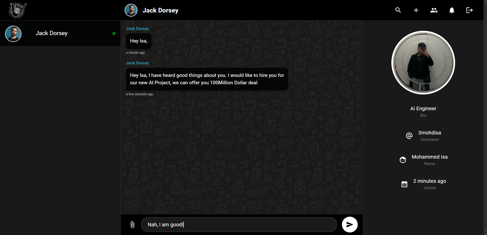

# 💬 MERN Stack Chat Application

A full-stack real-time chat application built with the MERN stack (MongoDB, Express.js, React.js, Node.js) featuring Socket.io for real-time communication, Material-UI for modern design, and comprehensive admin panel.



## 🚀 Features

### 🔐 **Authentication & User Management**
- **User Registration & Login**: Secure authentication with JWT tokens and bcrypt password hashing
- **Profile Management**: Users can update their profile with custom avatars uploaded to Cloudinary
- **Persistent Sessions**: Stay logged in across browser sessions with secure HTTP-only cookies

### 💬 **Real-Time Messaging**
- **Instant Messaging**: Send and receive messages in real-time using Socket.io
- **Online Status**: See who's online and offline in real-time
- **Typing Indicators**: Know when someone is typing a message
- **Message History**: All messages are stored and retrieved from MongoDB

### 👥 **Social Features**
- **Friend Requests**: Send and receive friend requests to connect with other users
- **Friend Management**: Accept or reject incoming friend requests
- **User Search**: Find and connect with other users by name
- **Notifications**: Get notified about new friend requests and messages

### 🏢 **Group Chat Functionality**
- **Create Groups**: Start group conversations with multiple participants
- **Group Management**: Add or remove members from group chats
- **Group Messaging**: Real-time messaging with multiple users simultaneously
- **Member Status**: See online/offline status of all group members

### 📁 **File Sharing**
- **Avatar Uploads**: Upload and manage profile pictures
- **File Attachments**: Share files and images in conversations (powered by Cloudinary)
- **Media Storage**: Secure cloud storage for all uploaded content

### 🛠️ **Admin Panel**
- **User Management**: View and manage all registered users
- **Chat Monitoring**: Monitor all chat conversations and activities
- **Message Analytics**: View message statistics and data visualization
- **Admin Dashboard**: Comprehensive overview with charts and metrics

### 🎨 **Modern UI/UX**
- **Material-UI Design**: Beautiful, responsive interface with Material Design principles
- **Dark/Light Theme Support**: Comfortable viewing in any lighting condition
- **Responsive Layout**: Works seamlessly on desktop, tablet, and mobile devices
- **Smooth Animations**: Enhanced user experience with Framer Motion animations

## 🛠️ Tech Stack

### **Frontend**
- **React 18**: Modern React with hooks and functional components
- **Vite**: Lightning-fast build tool and development server
- **Material-UI (MUI)**: Comprehensive React component library
- **Redux Toolkit**: Efficient state management
- **Socket.io Client**: Real-time communication
- **React Router**: Client-side routing
- **Axios**: HTTP client for API requests
- **Chart.js**: Data visualization for admin panel
- **Framer Motion**: Smooth animations and transitions

### **Backend**
- **Node.js**: JavaScript runtime environment
- **Express.js**: Web application framework
- **Socket.io**: Real-time bidirectional communication
- **MongoDB**: NoSQL database for data storage
- **Mongoose**: MongoDB object modeling
- **JWT**: JSON Web Tokens for authentication
- **bcrypt**: Password hashing and security
- **Cloudinary**: Cloud-based image and video management
- **Multer**: File upload handling

## 📁 Project Structure

```
MERN_STACK_CHAT_APPLICATION/
├── client/                 # React frontend application
│   ├── src/
│   │   ├── components/     # Reusable UI components
│   │   ├── pages/         # Application pages/routes
│   │   ├── redux/         # Redux store and slices
│   │   ├── hooks/         # Custom React hooks
│   │   └── utils/         # Utility functions
│   ├── public/            # Static assets
│   └── package.json       # Frontend dependencies
├── server/                # Express backend application
│   ├── controllers/       # Route controllers
│   ├── models/           # MongoDB data models
│   ├── routes/           # API route definitions
│   ├── middlewares/      # Custom middleware functions
│   ├── utils/            # Utility functions
│   └── package.json      # Backend dependencies
└── README.md             # Project documentation
```

## 🚀 Getting Started

### Prerequisites
- Node.js (v14 or higher)
- MongoDB Atlas account or local MongoDB installation
- Cloudinary account for file uploads

### Installation

1. **Clone the repository**
   ```bash
   git clone <repository-url>
   cd MERN_STACK_CHAT_APPLICATION
   ```

2. **Install server dependencies**
   ```bash
   cd server
   npm install
   ```

3. **Install client dependencies**
   ```bash
   cd ../client
   npm install
   ```

4. **Configure environment variables**
   
   Create `.env` file in the server directory:
   ```env
   MONGO_URI=your_mongodb_connection_string
   JWT_SECRET=your_jwt_secret_key
   CLOUDINARY_CLOUD_NAME=your_cloudinary_cloud_name
   CLOUDINARY_API_KEY=your_cloudinary_api_key
   CLOUDINARY_API_SECRET=your_cloudinary_api_secret
   ADMIN_SECRET_KEY=your_admin_secret_key
   NODE_ENV=DEVELOPMENT
   ```

   Create `.env` file in the client directory:
   ```env
   VITE_SERVER=http://localhost:3000
   ```

5. **Start the application**
   
   Start the server (from server directory):
   ```bash
   npm run dev
   ```
   
   Start the client (from client directory):
   ```bash
   npm run dev
   ```

6. **Access the application**
   - Frontend: http://localhost:5173
   - Backend API: http://localhost:3000
   - Admin Panel: http://localhost:5173/admin

## 🎯 Usage

### **For Users**
1. **Register**: Create a new account with username, password, bio, and avatar
2. **Login**: Sign in with your credentials
3. **Find Friends**: Search for users and send friend requests
4. **Start Chatting**: Begin one-on-one conversations with friends
5. **Create Groups**: Start group conversations with multiple friends
6. **Share Files**: Upload and share images and files in conversations

### **For Admins**
1. **Access Admin Panel**: Navigate to `/admin` and login with admin credentials
2. **Monitor Users**: View all registered users and their activities
3. **Manage Chats**: Monitor and manage all chat conversations
4. **View Analytics**: Access detailed statistics and data visualizations

## 🔧 API Endpoints

### **Authentication**
- `POST /api/v1/user/new` - Register new user
- `POST /api/v1/user/login` - User login
- `GET /api/v1/user/logout` - User logout

### **User Management**
- `GET /api/v1/user/me` - Get current user profile
- `GET /api/v1/user/search` - Search users
- `PUT /api/v1/user/sendrequest` - Send friend request
- `PUT /api/v1/user/acceptrequest` - Accept friend request

### **Chat Management**
- `POST /api/v1/chat/new` - Create new chat
- `GET /api/v1/chat/my` - Get user's chats
- `GET /api/v1/chat/my/groups` - Get user's groups
- `PUT /api/v1/chat/addmembers` - Add members to group

## 🤝 Contributing

1. Fork the repository
2. Create your feature branch (`git checkout -b feature/AmazingFeature`)
3. Commit your changes (`git commit -m 'Add some AmazingFeature'`)
4. Push to the branch (`git push origin feature/AmazingFeature`)
5. Open a Pull Request

## 📝 License

This project is licensed under the MIT License - see the [LICENSE](LICENSE) file for details.

## 🙏 Acknowledgments

- Socket.io for real-time communication
- Material-UI for the beautiful component library
- Cloudinary for file storage and management
- MongoDB Atlas for cloud database hosting

---

**Built with ❤️ using the MERN Stack**
